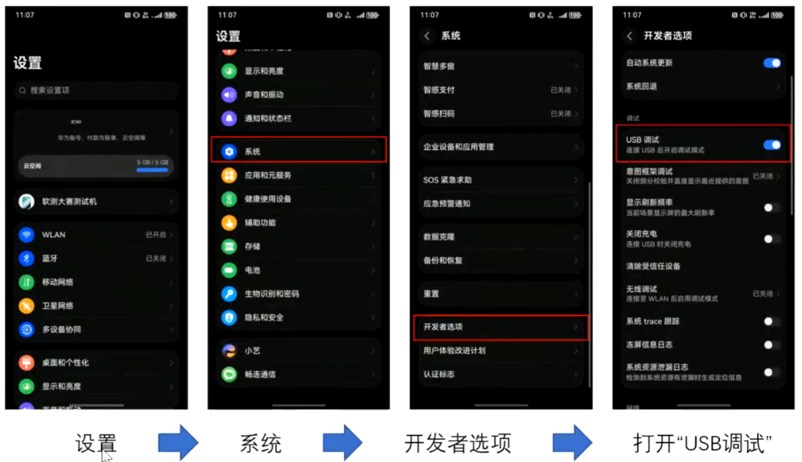

1. 
2. 测试设计、测试用例、用例测试结果（要有截图，与用例编号一致）
3. 
4. 
5. 
6. 
7. 
8. 给出多数好的，并且还要给出缺点
9. 测试用例都要有截图
10. 多渠道提前了解同学、体验店、网点、官方文档的原生智能
11. 

12.翻译：
1. **智慧修图**：HarmonyNext_IntelligentPhotoRetouching_ 或 Smart photo editing
2. **智慧构图**：HarmonyNext_IntelligentComposition_ 或 Smart composition
3. **智慧编辑**：HarmonyNext_IntelligentEditing_ 或 Smart editing

   1. 备忘录 - 润色改写
   2. 小艺帮写，润色，排版，摘要
   3. 翻译，思维导图，总结（其中涉及到文本编辑相关的总结等操作可归此类）
   4. 卷子去除笔记（可看作一种对文本内容编辑整理的操作，类似编辑功能范畴）

4. **智慧圈选**：HarmonyNext_IntelligentSelection_ 或 Smart circling selection

   1. 指关节圈选，识别明星。长按直接抠图 | 智慧圈选
   2. 根据短信圈选发起转账，免去复制粘贴
   3. 识别视频，这是哪部电影，演员是谁（通过类似圈选等操作引发的识别行为，可归此类）
   4. 识别人身上的衣服，购买，找同款（利用相关操作进行识别后进一步操作，符合智慧圈选引发服务的逻辑）

5. **智慧技能**：HarmonyNext_IntelligentSkills_ 或 Smart skills

   1. 逛小红书或者百度看到有个地点，导航去这（通过唤起小艺实现导航功能，属于智慧技能里涉及的操作）
   2. 准备去哪个地方，指定旅游计划（可借助小艺进行相关事务规划等操作，归此类）

   3. 阅读一篇新闻，唤起小艺问这是什么鸟（唤起小艺进行知识问答）

   4. 小艺帮记，记卡证，生日，填写表格的时候自动填补，身份证号码（属于小艺进行事务记忆相关功能）

   5. 娱乐圈的瓜，豆角事件是什么（唤起小艺进行知识问答了解相关内容）

   6. 微信的工作纪要转为日程（借助小艺等进行事务相关操作，如日程添加）

   7. 识别图片。这是什么？人？地方？景色？画片？（涉及对图片内容识别，与构图相关的图像元素识别有一定关联）

   8. 做高数题、英语卷子

   9. 自定义音色，先说一句话，然后让AI读另一句话

   10. 回答图片上的答案

   11. 分析文章，生成思维导图

6. **智慧拖拽**：HarmonyNext_IntelligentDragging_ 或 Smart dragging

   1. 提取文档。上半年 GDP 数据转 excel（涉及内容提取操作，类似智慧拖拽里提取相关功能）
   2. 归纳总结（与智慧拖拽中总结文档摘要等功能类似）
   3. 描述图片（属于智慧拖拽中描述图片内容和信息相关操作）
   4. 在备忘录里拖动一句话进小艺，添加日历（体现了拖拽操作及后续相关服务，归此类）
   5. 翻译，思维导图，总结（其中提取、总结等部分与智慧拖拽功能有契合点）

> 智慧优化：**现在长按导航条就能唤起小艺，而不是开关键** 常驻语音助手+全局AI解决方案 小艺能用全局，全局能用小艺
>
> 1. 识别图片。这是什么？人？地方？景色？画片？
>
> 2. **指关节圈选**，识别明星。长按直接抠图|智慧圈选
> 3. 唤起小艺
> 4. 逛小红书或者百度看到有个地点，导航去这
> 5. 准备去哪个地方，指定旅游计划
> 6. 做高数题、英语卷子
> 7. 提取文档。上半年GDP数据转excel
> 8. 归纳总结
> 9. 识别视频，这是哪部电影，演员是谁
> 10. 回答图片上的答案
> 11. 分析文章，生成思维导图
> 12. 备忘录-润色改写
> 13. 阅读一篇新闻，唤起小艺问这是什么鸟
> 14. 根据短信圈选发起转账，免去复制粘贴
> 15. 小艺帮写，润色，排版，摘要
> 16. 小艺帮记，记卡证，生日，填写表格的时候自动填补，身份证号码
> 17. 识别人身上的衣服，购买，**找同款**
> 18. 娱乐圈的瓜，豆角事件是什么
> 19. 微信的工作纪要转为日程
> 20. 翻译，思维导图，总结
> 21. 描述图片
> 22. 在备忘录里拖动一句话进小艺，添加日历
> 23. 自定义音色，先说一句话，然后让AI读另一句话
> 24. 卷子去除笔记
>
> 极致流畅：
>
> 1. 桌面模糊效果有进步，桌面缓慢下沉同时逐渐虚焦的过程，符合人眼或者镜头的物理规律。**立体空间感**，不是简单的平移。沉底
> 2. 图标和小空间都有阴影效果，
> 3. 结束进程上划有物理的虚化
> 4. 丝滑，字体加黑加粗有圆润感，简洁。圆形
> 5. 应用多开的分割线不是单纯的黑线，而是带有层次感。并且小横线变成了两点一线
> 6. 色彩更加丰富，简洁，清爽感，鲜艳
> 7. 应用市场：
>    1. 顶部菜单清楚、排版简化、底部按钮减少，没有拥挤感
>
> 其他（安全部分）：
>
> 1. 只能从应用市场安装应用，网页端、APP端不存在了诱导安装和第三方升级权限，避免恶意更新
> 2. 以前发一张图片都需要读取整个相册的读写权限。现在是只能读取选择的图片。系统从授权单一的权限改成了授权具体的数据，安全感拉满
> 3. 通话记录、短信、电话、已安装应用列表等取消对外开放。比如有时候表面上是只读取验证码，实际上读了整条短信，防不胜防。这样从源头上防止到位了，其他服务商就得遵守NEXT的隐私条款
> 4. 广告大大减少
> 5. 其他应用唤起的是原生相机，而不是软件自带的
>
> 
>
> 
>
> 应用市场：
>
> ​	全新的原生鸿蒙应用市场都有哪些特别之处,
>
> 那首先呢是安全,
>
> 那华为对于安全呢一直都是非常的重视,
>
> 那现在原生鸿蒙系统呢在应用安全方面呢,
>
> 不满足安全要求的软件呢都是无法上架,
>
> 也是无法安装和运行的,
>
> 那应用市场从源头就杜绝了那些不安全,
>
> 烂弹窗以及过度获取个人隐私的app,
>
> 那现在市面上有很多第三方的应用市场呢,
>
> 都可以下载软件来安装,
>
> 不仅很难监管,
>
> app的质量也是参差不齐啊,
>
> 那还有网页下载经常会弄一些假的下载按钮,
>
> 引导你去下载某些网站自己开发的一些软件,
>
> 然后再给你设很多没必要的使用门槛,
>
> 那即便是我们这种天天玩手机的专业用户,
>
> 搞得也很头疼啊,
>
> 那更别说家里的长辈,
>
> 还有一些不太懂手机的普通用户了,
>
> 那比如说之前呢我就遇到过,
>
> 有一些软件呢看起来很正常,
>
> 那下载以后呢却是无限的弹窗广告啊,
>
> 简直就是广告播报器嘛,
>
> 那导致你根本无法使用这个软件,
>
> 那其他几个品牌的手机呢我都试了,
>
> 即便是官方应用商店下载的app,
>
> 也都是各种的弹窗,
>
> 反而当时鸿蒙4.2系统当中的,
>
> 利用商店下载的同款软件都是很纯净,
>
> 完全没有弹窗的问题,
>
> 那这是之前鸿蒙4.2的情况,
>
> 现在原生鸿蒙应用市场呢,
>
> 更是直接从根源上杜绝了这类问题啊,
>
> 保证了个人隐私的安全,
>
> 也保证了基础的用户体验,
>
> 然后在app使用的过程当中呢,
>
> 个人的隐私安全是所有人都需要关注的,
>
> 之前你下载一个手机app,
>
> 第一次使用的时候呢,
>
> 总有各种的弹窗让你挨个去授权,
>
> 即便是有一些app只是用来换个头像,
>
> 而却要获取你全部的相册权限,
>
> 那只是给家里人充个话费,
>
> 也需要获得全部联系人的权限,
>
> 以前呢我们只能默默的给出相应的权限,
>
> 却从来没有想过再去关闭这个权限,
>
> 这对于个人隐私来说呢是非常不利的,
>
> 有一些app呢可能就会通过这种方式来过度获取,
>
> 你的隐私信息,
>
> 那现在原生鸿蒙的做法,
>
> 就是从系统底层重构了权限的逻辑啊,
>
> 安全访问的功能呢,
>
> 就可以让用户从管权限到管数据啊,
>
> 比如说当你需要发送一个图片的时候呢,
>
> 原来的系统的授权逻辑呢,
>
> 就是把整个相册的权限全部授权给这个app,
>
> 理论上,
>
> app是可以轻松获取到你相册里面的所有图片的,
>
> 这对于隐私来说是非常不利的对吧,
>
> 而现在在原生home目当中呢,
>
> 则会调用系统的相册模块,
>
> 界面上呢也会有安全访问图库的提示啊,
>
> 当你选择一个图片确认以后呢,
>
> 这个app才会获得这张照片的授权,
>
> 那除了这个照片以外,
>
> 其他的图片相册是无权访问的,
>
> 在发布会上用的这个动画演示也是非常直观,
>
> 以前呢是你把家里的钥匙授权出去,
>
> 别人可以随意到你家里翻找你屋里的所有东西,
>
> 那原神鸿蒙的做法就是像有一个管家一样啊,
>
> 别人需要什么东西,
>
> 管家就会单独把这个东西拿给他,
>
> 那相比较来说的话确实会更安全也更安心,
>
> 那除了相册啊,
>
> 包括相机呢也是一样的原理,
>
> 那现在在原生鸿蒙当中啊,
>
> 同样的场景下也是调用相机的拍照模块,
>
> 顶部也会有安全访问相机的一个提示,
>
> 那这个时候的取景框是系统本身的功能,
>
> 跟app是没有任何关系的,
>
> 只有当你按下拍照按键确认以后啊,
>
> 系统才会把你刚刚拍的这个照片呢,
>
> 授权给app来使用,
>
> 就很好的避免了app过度获取你个人隐私的,
>
> 这种问题了,
>
> 那其他还有文件,
>
> 音频等等都有安全访问的提示,
>
> 所以说使用原生鸿蒙应用市场下载的app,
>
> 都可以很好的避免了个人隐私泄露的问题,
>
> 那么在视觉上,
>
> 原生鸿蒙应用市场的图标呢也进行了重绘,
>
> 里面的字体啊就变成了app gallery啊,
>
> 这代表呢不仅仅可以下载app啊,
>
> 更是gallery艺术画廊,
>
> 那你可能以为这是针对原生鸿蒙系统,
>
> 单独取的名字,
>
> 但其实华为的应用市场的网站呢,
>
> 一直都是app gallery啊,
>
> 这也很好的诠释了华为的应用市场呢,
>
> 一直都不只是用来下载软件的,
>
> 那进入界面就可以看到啊,
>
> 原生鸿蒙应用市场当中呢,
>
> 这个界面呢更加简洁一些了啊,
>
> 把探索和推荐两个页面呢合成在一起,
>
> 并且界面上呢也进行了重新布局,
>
> 那展开动画呢也更加的流畅丝滑,
>
> 那主页的上半部分呢是新增的主打推荐板块,
>
> 有50多个专业的编辑团队呢精心挑选,
>
> 深度试玩以后,
>
> 再配合详细的介绍啊,
>
> 还有杂志化的卡片来进行展示出来,
>
> 并且呢主打推荐呢也会持续更新啊,
>
> 时不时的打开看一看,
>
> 说不定就能发现一些宝藏的app,
>
> 那除了主页,
>
> 其他几个页面也都是按照顶部大卡片,
>
> 底部小分类的方式来进行布局,
>
> 每个app的显示区域呢也比之前更大一些啊,
>
> 除了图标以外呢,
>
> 还有一些简单的介绍,
>
> 可以很好的避免了有一些app名字过长啊,
>
> 导致显示不全的问题,
>
> 那其他像搜索页面呢,
>
> 个人页面呢也都是一样的逻辑,
>
> 那对比于之前呢确实显得更简洁,
>
> 浏览起来也会更舒服一些了,
>
> 然后在单独的app展示页呢也进行了重新布局,
>
> 主要的变化呢就是把app的截图呢进行放大显示,
>
> 那显示的位置也更靠上一些,
>
> 即便是不展开,
>
> 也可以快速了解app相关的功能,
>
> 而且点开的动画呢也更加的协调,
>
> 更加的流畅了,
>
> 那针对隐私安全方面的问题呢,
>
> IPAD页面也用数据收集类别一览,
>
> 来详细的展示了出来,
>
> 比如说某一些出行类的软件啊,
>
> 提示在运行过程当中呢,
>
> 可能就会收集联系人的信息,
>
> 交易信息,
>
> 位置信息,
>
> 标识符,
>
> 基本资料,
>
> 应用信息,
>
> 还有这个设备信息等等啊,
>
> 那点开以后呢还可以看到更加详细的介绍,
>
> 那这些都是app在使用过程当中,
>
> 需要主动收集的信息,
>
> 还有一些软件呢是不需要收集用户的信息啊,
>
> 所以在这一栏呢也会显示出来,
>
> 不会收集任何个人信息,
>
> 那所以这对比之前权限管理的逻辑呢,
>
> 不仅更安全,
>
> 也会让用户呢更加清晰明了,
>
> 下载更安心,
>
> 那另外像刚才我们提到的,
>
> 这个新推出的安全访问机制呢,
>
> 也都会单独标出来,
>
> 比如说音频图库,
>
> 相机,
>
> 还有文件等等啊,
>
> 那这些权限呢之前的系统呢都只能全部授权,
>
> 现在通过新的机制呢也变得更加安全了,
>
> 那毕竟是全新的系统,
>
> 那很多地方都可以更加方便的进行重构,
>
> 彻底的摆脱了以前的修修补补啊,
>
> 以及一些很难彻底解决的问题啊,
>
> 那另外对于未成年人模式呢,
>
> 原生鸿蒙做的也更加彻底一些,
>
> 除了系统当中通过健康使用设备的选项,
>
> 开启青少年模式以外,
>
> 现在在原生鸿蒙应用市场啊,
>
> 也可以通过应用服务模式开启这个青少年模式,
>
> 那开启以后呢,
>
> 应用市场就会变成了一个更加简洁的模式,
>
> 桌面上已经下载的图标呢,
>
> 也会有这个使用时间的限制,
>
> 那因为目前啊原生鸿蒙app生态呢还在逐渐完善,

